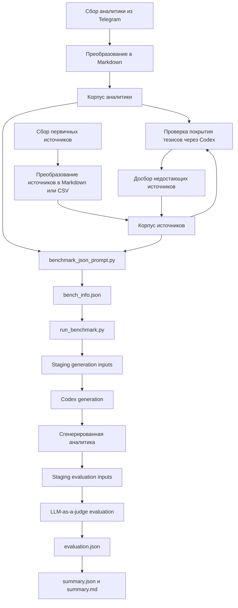
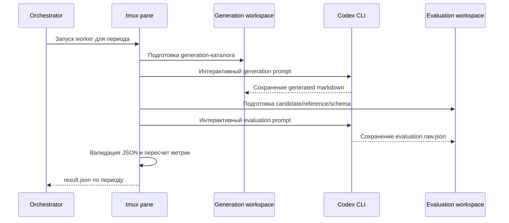

# Пайплайн сбора датасета и процедура бенчмаркинга восстановления финансовой аналитики

## 1. Назначение и постановка задачи

В рамках данной работы бенчмаркинг рассматривается как задача восстановления нового аналитического обзора по компании на основе двух типов входных данных:

1. аналитических материалов за предыдущие периоды, подготовленных человеком;
2. набора первичных источников, которые были доступны на момент целевого периода.

Такой сценарий моделирует реальную работу инвестиционного аналитика во времени. На каждом шаге модель должна не просто извлечь отдельные факты из отчетности, а собрать связный аналитический текст, учитывающий историю компании, динамику прошлых тезисов и содержание текущих источников. В отличие от абстрактных QA-бенчмарков, здесь оценивается способность системы восстанавливать полноценную аналитическую записку для нового периода, не используя знания из будущего.

Ключевая идея методики состоит в организации корпуса как хронологической последовательности периодов. Для периода `N` модели разрешено видеть только:

- аналитические документы периодов `1..N-1`;
- источники, доступные не позже периода `N`.

Эталоном качества служит человеческий аналитический документ периода `N`, с которым затем сравнивается сгенерированный текст.

## 2. Структура датасета

Каждый датасет организован как отдельный каталог компании. Текущая реализация исходит из следующей структуры:

```text
<dataset_root>/
  аналитика/
  источники/
  bench_info.json
  benchmark_results/
```

Назначение каталогов следующее:

- `аналитика/` содержит эталонные человеческие аналитические обзоры по последовательным периодам;
- `источники/` содержит первичные документы, на основании которых могла строиться аналитика: отчетность, пресс-релизы, новости, отраслевые материалы, дивидендные документы, котировки и иные вспомогательные данные;
- `bench_info.json` задает формальную конфигурацию benchmark-периодов;
- `benchmark_results/` содержит результаты запусков бенчмарка.

Содержательно датасет представляет собой не произвольный архив документов, а временно упорядоченный корпус. Это принципиально важно, поскольку benchmark должен проверять генерацию в условиях ограниченной по времени информации.

## 3. Пайплайн сбора датасета

Методика формирования датасета зафиксирована в `make_dataset_pipeline.md` и дополняется автоматической генерацией benchmark-конфигурации через `prompts/benchmark_json_prompt.py`. По текущей реализации pipeline состоит из нескольких стадий.

### 3.1. Сбор человеческой аналитики

На первом этапе собираются готовые аналитические документы из Telegram-канала. Эти материалы выступают одновременно:

- историческим контекстом для генерации последующих периодов;
- эталонными ответами для benchmark-оценки.

Именно поэтому для датасета важна корректная хронология аналитики. Названия файлов служат лишь первичной подсказкой; при построении benchmark-конфигурации дополнительно анализируются заголовки и содержимое самих Markdown-документов, чтобы восстановить реальную последовательность периодов.

### 3.2. Преобразование аналитики в Markdown

Собранные документы переводятся в Markdown-представление. Если исходный материал содержит графики и диаграммы, они по возможности преобразуются в таблицы. Такая нормализация преследует две цели:

1. унифицировать формат хранения;
2. сделать количественные данные пригодными для обработки LLM без необходимости повторного визуального распознавания.

В результате аналитика попадает в каталог `аналитика/` в виде текстовых Markdown-файлов, пригодных как для чтения человеком, так и для последующего машинного анализа.

### 3.3. Первичное наполнение корпуса источников

На следующем этапе в датасет добавляется максимально полный набор релевантных источников, который мог использовать аналитик. В `make_dataset_pipeline.md` явно указаны следующие приоритетные группы:

- доступная информация с сайта компании;
- дивидендная политика;
- котировки с MOEX.

На практике этот слой расширяется также отчетностью, пресс-релизами, отраслевыми обзорами, новостями и дополнительными табличными данными. Источники приводятся к Markdown-формату, а рыночные данные могут храниться в табличных файлах, например `csv`.

### 3.4. Проверка покрытия тезисов и досбор недостающих источников

После первичного наполнения корпуса используется Codex для проверки полноты покрытия. Модели предлагается исследовать тезисы и факты из аналитики и определить, какие из них уже подтверждаются собранными источниками, а какие пока не имеют достаточной документальной опоры.

Этот шаг важен по двум причинам:

- он снижает риск того, что benchmark будет оценивать генерацию по эталону, который сам не обеспечен источниками;
- он позволяет расширять датасет целенаправленно, а не путем механического наращивания числа документов.

Если выявляются непокрытые факты, выполняется дополнительный поиск релевантной информации, после чего новые материалы также преобразуются в Markdown и добавляются в корпус источников.

### 3.5. Формирование benchmark-конфигурации

После стабилизации корпуса используется `prompts/benchmark_json_prompt.py`. Этот скрипт строит дерево датасета и формирует промпт для Codex, который должен:

1. исследовать все файлы в `аналитика/`;
2. восстановить реальную хронологию аналитических периодов;
3. для каждого периода `N >= 2` собрать объект benchmark-конфигурации.

Логика здесь соответствует схеме rolling-origin, то есть скользящему хронологическому окну: первый аналитический документ не оценивается, а используется как стартовый контекст; начиная со второго документа каждый период становится отдельной benchmark-задачей.

### 3.6. Правила защиты от утечки будущих данных

Формирование `bench_info.json` подчиняется явным временным ограничениям:

- в `analytics` попадают все аналитические документы из предыдущих периодов `1..N-1`;
- в `sources` попадают только те источники, которые были доступны не позже периода `N`;
- документы, опубликованные позже целевого периода, запрещено включать;
- если документ существовал в период `N`, но внутри содержит прогнозы на более поздние даты, это не считается утечкой и такой документ может быть включен.

Отдельно в промпте указано, что котировочные и иные табличные данные при необходимости должны разбиваться в соответствии с хронологией периодов, чтобы в конкретную benchmark-задачу попадала только допустимая по времени часть временного ряда.

## 4. Формальная структура benchmark-конфигурации

Результатом предыдущего этапа становится файл `bench_info.json`. Его верхний уровень должен быть JSON-объектом со строковыми ключами `"2"`, `"3"`, ... по возрастанию и без пропусков. Период `"1"` отсутствует намеренно.

Для каждого периода задаются следующие поля:

| Поле | Смысл |
| --- | --- |
| `analytics` | Список аналитических Markdown-документов всех предыдущих периодов |
| `sources` | Список разрешенных источников, доступных не позже целевого периода |
| `generated_analysis_period_description` | Человеко-читаемое описание целевого периода |
| `generated_analysis_name` | Имя файла, в который модель должна сохранить итоговую аналитику |
| `reference_analysis_path` | Эталонный аналитический документ целевого периода |

Типичный объект периода имеет вид:

```json
{
  "2": {
    "analytics": ["аналитика/<файл_периода_1>.md"],
    "sources": ["источники/<релевантный_источник>.md"],
    "generated_analysis_period_description": "апрель 2025, результаты I квартала 2025 года",
    "generated_analysis_name": "<эталон>-generated.md",
    "reference_analysis_path": "аналитика/<эталон>.md"
  }
}
```

Во время исполнения `execute_benchmark/run_benchmark.py` это описание нормализуется в строгую внутреннюю структуру. В частности:

- `generated_analysis_name` должен быть одиночным именем файла без пути;
- `reference_analysis_path` должен быть непустым и относительным путем внутри `аналитика/`;
- при подготовке запуска одиночный путь нормализуется в список `reference_analysis_paths`, что позволяет оценивать период по одному или нескольким эталонным документам.

Таким образом, `bench_info.json` задает не только набор файлов, но и строгий контракт допустимой информации для каждого периода.

## 5. Подготовка benchmark-окружения

Пользовательской точкой входа служит `execute_benchmark/exec.sh`. Этот скрипт:

1. определяет корень репозитория;
2. при наличии загружает `.env`;
3. при необходимости копирует `LLM_API_KEY` в `OPENROUTER_API_KEY`;
4. запускает `python -m execute_benchmark.run_benchmark`.

Основной orchestration реализован в `execute_benchmark/run_benchmark.py`.

### 5.1. Выбор периодов и ограничения запуска

При запуске orchestrator:

- загружает `bench_info.json`;
- валидирует структуру периодов;
- выбирает либо все периоды, либо только периоды, явно указанные через `--period`;
- ограничивает один запуск максимум четырьмя периодами.

Ограничение в четыре периода связано не с методологией benchmark, а с текущим tmux-интерфейсом исполнения, в котором каждый период получает собственную pane.

### 5.2. Создание каталогов запуска

Для каждого benchmark-run создается уникальный `run_id` и каталог результатов:

```text
<dataset_root>/benchmark_results/<run_id>/
```

Параллельно создается временный staging-каталог:

```text
/tmp/analyze/<run_id>/
```

Внутри него для каждого периода формируются отдельные рабочие подкаталоги:

```text
/tmp/analyze/<run_id>/<period>/generation/
/tmp/analyze/<run_id>/<period>/evaluation/
```

Такое разбиение обеспечивает изоляцию периодов и исключает случайное смешение входных данных разных benchmark-задач.

### 5.3. Staging generation-входов

Перед запуском модели выполняется материализация разрешенного входного контекста. Для каждого периода создается generation-каталог, в который копируются только разрешенные файлы:

- `аналитика/` с человеческими аналитическими обзорами прошлых периодов;
- `документы/` с допустимыми источниками.

Фактически `документы/` формируются из путей `sources`, которые указывают на элементы исходного каталога `источники/`. Копирование выполняется так, чтобы модель внутри рабочей папки видела только разрешенное подмножество корпуса. Если у файлов есть companion-директории вида `_images` или `_files`, они также переносятся.

Эта логика реализована через `populate_period()` и связанный набор утилит в `execute_benchmark/copy_benchmark.py`. Тот же модуль можно использовать отдельно для сборки benchmark-папок или staging одного периода для ручного прогона.

### 5.4. Формирование prompt-артефактов

Для каждого периода orchestrator заранее записывает два файла в `benchmark_results/<run_id>/<period>/`:

- `generation.prompt.txt`;
- `evaluation.prompt.txt`.

Таким образом, все текстовые инструкции для модели фиксируются рядом с результатами периода и могут быть проанализированы постфактум.

## 6. Выполнение generation stage

Generation stage предназначен для восстановления новой аналитики по целевому периоду.

### 6.1. Семантика generation prompt

Промпт инструктирует модель:

- использовать аналитику прошлых периодов из `аналитика/`;
- использовать первичные источники из `документы/`;
- сформировать аналитику по новому целевому периоду;
- сохранить итоговый Markdown-документ в файл с именем `generated_analysis_name`.

В prompt специально зафиксировано, что модель должна в первую очередь опираться на локальные файлы, находящиеся в текущей рабочей папке. Дополнительный поиск в интернете допускается лишь как вспомогательный механизм и не должен подменять локальный корпус или опираться на неофициальные оценочные мнения, если они не присутствуют в исторической аналитике.

Следовательно, benchmark в основном опирается на локальный корпус, но не является полностью closed-book: текущий контракт допускает ограниченное внешнее информационное дополнение. Это следует учитывать при интерпретации воспроизводимости.

### 6.2. Механика запуска

Исполнение организовано через `tmux`. Для одного запуска создается отдельная tmux-session, внутри которой открывается окно `benchmark`, а затем оно разбивается на 1-4 pane в зависимости от числа периодов.

В каждой pane запускается отдельный worker-процесс для строго одного периода. Внутри worker:

1. стартует интерактивный `codex` CLI;
2. рабочей директорией назначается generation-каталог периода;
3. в качестве модели по умолчанию используется `gpt-5.4`, но параметр может быть переопределен через `--model`;
4. prompt передается непосредственно в вызов `codex`.

Текущая реализация использует именно интерактивный `codex`, а не `codex exec`. Это важно, поскольку после завершения сессии worker ожидает физическое наличие выходного файла в рабочем каталоге.

### 6.3. Критерий успешности generation

Generation stage считается успешным, если:

- ожидаемый файл создан;
- файл не пуст;
- `codex` завершился допустимым кодом возврата.

После этого сгенерированный Markdown копируется в каталог:

```text
benchmark_results/<run_id>/<period>/generated/
```

Если файл не появился или оказался пустым, период помечается как failed еще до перехода к стадии evaluation.

### 6.4. Логирование

Для стадии generation создаются файлы:

- `generation.stdout.log`;
- `generation.stderr.log`.

Они содержат служебную информацию о рабочем каталоге, prompt-файле, ожидаемом выходном файле и коде завершения процесса. Полный tmux transcript в логи не записывается. Это значит, что результаты запуска реплицируемы на уровне артефактов и кодов завершения, но не на уровне полной истории интерактивного диалога с CLI.

## 7. Выполнение evaluation stage

После успешной генерации тот же worker автоматически переходит к оценке результата.

### 7.1. Подготовка evaluation-окружения

Для периода создается отдельный evaluation-каталог со структурой:

```text
evaluation/
  candidate/
  reference/
  evaluation.schema.json
```

В `candidate/` помещается сгенерированный документ, в `reference/` копируются эталонные аналитические материалы периода. Если эталонных файлов несколько, они все попадают в `reference/`.

### 7.2. Семантика evaluation prompt

Evaluation prompt задает отдельную задачу LLM-as-a-judge: сравнить candidate-аналитику с reference-аналитикой и сформировать structured JSON в соответствии с `evaluation.schema.json`.

Ключевые правила сравнения следующие:

- reference-документы считаются источником истины для оценки периода;
- оценка выполняется на уровне отдельных содержательных утверждений, то есть claim-level coverage;
- совпадение засчитывается, если смысл тезиса восстановлен корректно, даже при иной формулировке;
- не засчитываются искаженные, ослабленные или отсутствующие тезисы;
- в `missing_reference_claims` перечисляются ключевые тезисы, отсутствующие в candidate;
- в `unsupported_generated_claims` перечисляются ключевые тезисы candidate, не подтверждаемые reference.

Таким образом, evaluation измеряет не стилистическую близость текстов, а степень содержательного покрытия эталонной аналитики и число неподтвержденных добавлений.

### 7.3. JSON-контракт оценщика

Согласно `execute_benchmark/evaluation.schema.json`, evaluator обязан вернуть объект со следующими полями:

| Поле | Смысл |
| --- | --- |
| `reference_claims_count` | число уникальных существенных тезисов в эталонных документах |
| `generated_claims_count` | число уникальных существенных тезисов в candidate |
| `matched_claims_count` | число эталонных тезисов, корректно восстановленных в candidate |
| `precision` | доля тезисов candidate, подтверждаемых эталоном |
| `recall` | доля тезисов эталона, восстановленных candidate |
| `missing_reference_claims` | список ключевых тезисов эталона, отсутствующих в candidate |
| `unsupported_generated_claims` | список ключевых тезисов candidate, не подтвержденных эталоном |
| `comment` | краткий качественный вывод по периоду |

Evaluator сохраняет этот JSON в `evaluation.raw.json`, после чего runner валидирует содержимое программно.

### 7.4. Программная валидация оценки

После завершения evaluator-сессии `run_benchmark.py` дополнительно проверяет:

- что ответ является JSON-объектом;
- что числовые поля имеют корректные типы и неотрицательны;
- что `precision` и `recall` лежат в диапазоне `[0, 1]`;
- что `matched_claims_count` не превышает ни `reference_claims_count`, ни `generated_claims_count`;
- что списковые поля действительно состоят из строк.

Только после успешной проверки формируется финальный `evaluation.json`.

### 7.5. Пересчет метрик в runner

Хотя evaluator возвращает `precision` и `recall`, текущая реализация runner пересчитывает итоговые значения самостоятельно на основе счетчиков claim-ов. Используются следующие формулы:

```text
precision = matched_claims_count / generated_claims_count
recall    = matched_claims_count / reference_claims_count
f1        = 2 * precision * recall / (precision + recall)
```

Если знаменатель равен нулю, соответствующее отношение принимается равным `0`. Значения округляются до шести знаков после запятой.

Это решение повышает согласованность результатов, поскольку финальные метрики вычисляются единообразно на стороне orchestrator, а не полностью доверяются текстовому ответу evaluator.

## 8. Итоговые артефакты периода и запуска

После завершения двух стадий для каждого периода формируются следующие основные артефакты:

```text
benchmark_results/<run_id>/<period>/
  generation.prompt.txt
  evaluation.prompt.txt
  generation.stdout.log
  generation.stderr.log
  evaluation.stdout.log
  evaluation.stderr.log
  generated/<generated_analysis_name>
  evaluation.json
  result.json
```

Файл `result.json` агрегирует статус периода и ссылки на релевантные файлы. Помимо путей к артефактам, он содержит:

- статус `completed` или `failed`;
- значения `reference_claims_count`, `generated_claims_count`, `matched_claims_count`;
- `precision`, `recall`, `f1`;
- краткий комментарий;
- текст ошибки, если одна из стадий завершилась неуспешно.

Когда все периоды текущего запуска завершены, orchestrator формирует run-level summary:

- `summary.json`;
- `summary.md`.

Кроме того, в корне запуска сохраняется `run_manifest.json`, фиксирующий параметры запуска: `run_id`, путь к датасету, путь к staging-каталогу, модель, исполняемый `codex`-бинарь, список периодов и нормализованные benchmark-entry для каждого периода. После сборки итоговой сводки временный staging-каталог удаляется, если запуск не был выполнен с флагом `--keep-stage`.

## 9. Агрегация метрик на уровне запуска

Итоговая сводка запуска строится как macro-average по успешно завершенным периодам. Это означает, что:

- сначала для каждого периода вычисляются собственные `precision`, `recall` и `f1`;
- затем по completed-periods берется среднее арифметическое по каждой метрике;
- failed-periods в макроусреднение не включаются.

Такой способ агрегации уравнивает вклад разных периодов и не позволяет одному периоду с большим числом claim-ов полностью доминировать в итоговой оценке. Одновременно это означает, что итоговые метрики уровня запуска следует интерпретировать как среднее качество по benchmark-задачам, а не как глобальную micro-метрику по всему корпусу утверждений.

## 10. Схема полного процесса

Ниже приведена сводная схема текущего пайплайна от сбора датасета до получения benchmark-метрик.



Для процесса исполнения одного периода удобно также выделить последовательность действий worker:



## 11. Методологические достоинства подхода

Предложенный benchmark имеет несколько важных преимуществ.

Во-первых, он проверяет задачу, близкую к реальной профессиональной деятельности аналитика. Модели требуется восстановить не одно число и не короткий ответ, а целостный инвестиционный текст.

Во-вторых, benchmark строится хронологически. Это делает задачу существенно более реалистичной, чем оценка на полном статическом архиве документов.

В-третьих, используется строгая материализация разрешенного контекста для каждого периода. За счет staging-папок модель физически изолируется от нерелевантной части корпуса.

В-четвертых, оценка ориентирована на claim-level coverage, а значит учитывает семантическое содержание аналитики, а не только поверхностное сходство формулировок.

Наконец, результат каждого периода сопровождается набором прозрачных артефактов: prompt-файлами, generated markdown, evaluation JSON, статусом периода и итоговой сводкой запуска.

## 12. Ограничения и угрозы валидности

Несмотря на практическую полезность, текущая методика имеет ряд ограничений.

### 12.1. Эталоном является человеческая аналитика, а не абсолютная истина

Benchmark не сравнивает модель напрямую с финансовой реальностью компании. Ground truth периода определяется через `reference_analysis_path`, то есть через человеческий аналитический текст. Следовательно, benchmark оценивает степень воспроизведения авторской аналитической позиции, а не строго объективной истины.

### 12.2. Оценка также выполняется LLM

Стадия evaluation реализована как LLM-as-a-judge. Несмотря на наличие формальной JSON-схемы и дополнительной программной валидации, само выделение claim-ов и решение о semantic match остается модельно-зависимым. Поэтому результаты нельзя считать полностью детерминированными экспертными оценками.

### 12.3. Generation prompt допускает внешний интернет-поиск

Текущий prompt разрешает модели при необходимости искать недостающую информацию в интернете. Это ослабляет строгую closed-book природу benchmark. На практике локальный корпус объявлен приоритетным, однако сам факт разрешенного внешнего поиска должен быть отдельно оговорен при описании экспериментального дизайна.

### 12.4. Полные интерактивные транскрипты не сохраняются

Логи фиксируют только рабочие каталоги, prompt-файлы и коды завершения. Полный диалог с `codex` в tmux-pane не архивируется. Это ограничивает аудируемость поведения модели на уровне промежуточных интерактивных шагов.

### 12.5. Макроусреднение скрывает различия в размере периодов

Использование macro-average делает все benchmark-periods равновесными, но одновременно игнорирует различия в числе claim-ов между ними. Поэтому наряду с итоговыми усредненными метриками полезно анализировать и результаты по отдельным периодам.

## 13. Вывод

Таким образом, предложенный pipeline объединяет два взаимосвязанных процесса: построение хронологически согласованного датасета и выполнение benchmark-задач восстановления аналитики по периодам. Сначала формируется корпус человеческой аналитики и первичных источников, затем на его основе автоматически создается `bench_info.json`, задающий допустимый контекст для каждого периода. После этого `execute_benchmark` материализует изолированные рабочие окружения, запускает generation и evaluation через `Codex`, формирует claim-level метрики и агрегирует их на уровне запуска.

С методологической точки зрения такой benchmark лучше всего подходит для сравнительного анализа моделей, промптов и workflow-подходов к генерации финансовой аналитики. Он не устраняет полностью субъективность эталонов и модели-оценщика, однако обеспечивает существенно более реалистичную и практически значимую постановку задачи, чем простые текстовые benchmark-наборы без временной структуры и без контроля допустимого информационного контекста.
